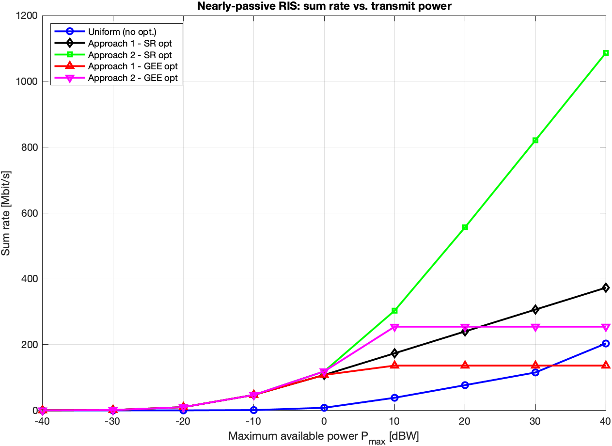
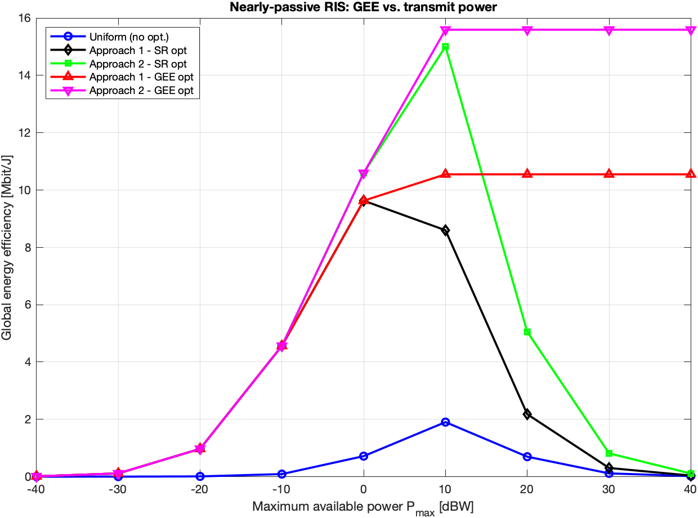
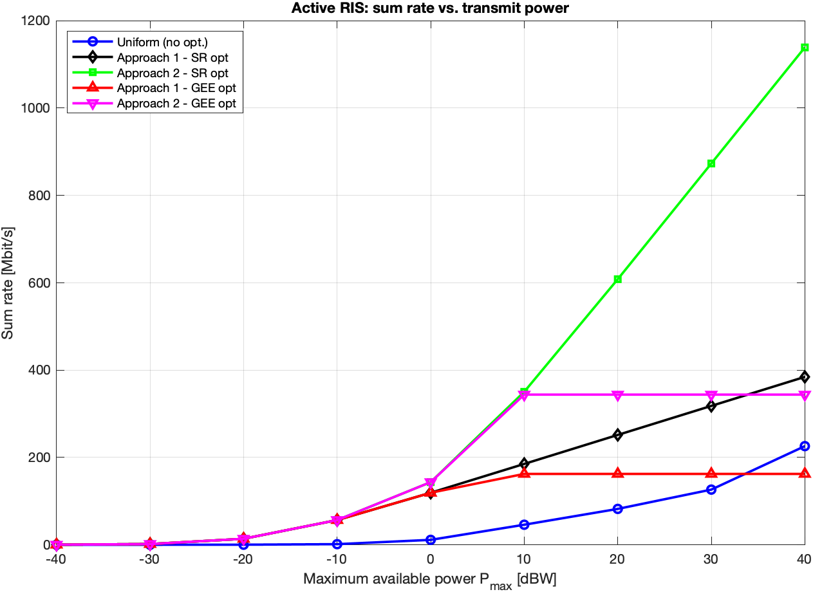
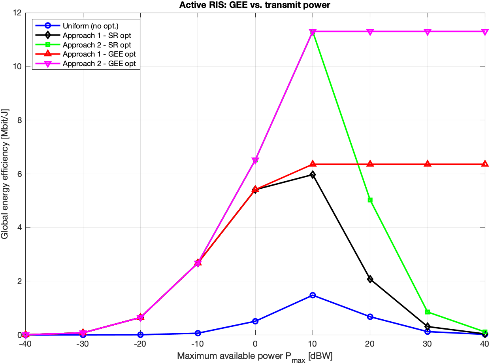

# Energy-Efficiency Optimization in RIS-Aided Wireless Networks

[](https://github.com/bigdoll/RIS-GEE-Optimization/actions/workflows/ci.yml)
[](LICENSE)


[](https://doi.org/10.1109/TCOMM.2023.3320963)

MATLAB implementation of the resource-allocation algorithms in:

> R. K. Fotock, A. Zappone, and M. Di Renzo,
> **"Energy Efficiency Optimization in RIS-Aided Wireless Networks: Active Versus
> Nearly-Passive RIS With Global Reflection Constraints,"**
> *IEEE Transactions on Communications*, vol. 72, pp. 257–272, 2024.
> [hal-04734167](https://hal.science/hal-04734167v1)

The code maximizes the **global energy efficiency (GEE)** in the uplink of a
multi-user RIS-aided network, jointly optimizing the RIS reflection
coefficients, the users' transmit powers, and the BS linear receive filters,
for both an **active** and a **nearly-passive** RIS subject to a **global**
(rather than per-element) reflection constraint.

---

## System model (one paragraph)

`K` single-antenna users transmit to an `N_R`-antenna base station through an
RIS with `N` elements. The user→RIS channels are `H` (`N×K`) and the RIS→BS
channel is `G` (`N_R×N`). Writing the RIS reflection vector as `gamma`, user
`k`'s SINR is

```
SINR_k = p_k |c_k^H A_k gamma|^2 / ( c_k^H W c_k + sum_{m≠k} p_m |c_k^H A_m gamma|^2 )
```

with `A_k = G diag(h_k)` and `W` the colored-noise covariance. The objective is

```
GEE = B * sum_k log2(1 + SINR_k) / P_tot
```

subject to a **global** reflection constraint `tr(R) ≤ tr(R gamma gamma^H) ≤ PR_max + tr(R)`
(active) or `tr(R gamma gamma^H) ≤ tr(R)` (nearly-passive), where
`R = sum_k p_k H_k^H H_k + sigma_RIS^2 I_N` (Eq. (6)). Full notation is in
[`docs/system_model.md`](docs/system_model.md).

---

## Two solution algorithms

| | Approach 1 — alternating | Approach 2 — MMSE-embedded |
|---|---|---|
| Variables | `p`, `gamma`, `C` (filters) | `p`, `X = gamma gamma^H` |
| Idea | Alternate the three blocks; filters via closed-form LMMSE | Embed the LMMSE filters into the GEE; lift to `X` and use SDR |
| Paper | Algorithms 1–3 (Sec. IV-A) | Algorithms 4–6 (Sec. IV-B) |
| RIS step | `gamma_cvxopt_*` (Alg. 1, Prob. 38) | `*cvxopt_X` / `X_cvxopt_*` (Alg. 4, Prob. 54) |
| Power step | `p_cvxopt_*` (Alg. 2, Prob. 43) | `power2_cvxopt` / `p_cvxopt_*2` (Alg. 5, Prob. 56) |
| Driver | `alt_opt1` / `altopt1_active` (Alg. 3) | `alt_opt2` / `altopt2_active` (Alg. 6) |

Both algorithms monotonically improve the GEE, are provably convergent, have
polynomial complexity, and apply to active and nearly-passive RISs. Each
non-convex subproblem is handled by **sequential fractional programming**: a
concave surrogate (`*approx*`) is built around the current point and solved with
**CVX**; the procedure is iterated to convergence.

---

## Repository layout

```
RIS-GEE-Optimization/
├── examples/
│   ├── run_active_ris.m      # Figs. 2-3: active RIS, GEE/SR vs. power
│   ├── run_passive_ris.m     # Figs. 2-3: nearly-passive RIS
│   └── figures/              # one script per remaining paper figure
│       ├── gee_active.m, gee_passive.m   # shared evaluation helpers
│       ├── fig4_gee_vs_pcn.m             # Fig. 4: GEE vs active static power
│       ├── fig5_gee_vs_N.m               # Fig. 5: GEE vs number of elements
│       ├── fig6_global_vs_local.m        # Fig. 6: global vs local constraint
│       ├── fig7_gee_vs_position.m        # Fig. 7: GEE vs RIS placement
│       └── tables_convergence.m          # Tables I-II: iterations & time
├── src/
│   ├── common/               # shared system-model & utilities
│   │   ├── generate_channels.m, noise_power.m, available_power.m
│   │   ├── static_power_consumption.m, data_rate.m, func_R.m (Eq. 6)
│   ├── active_ris/
│   │   ├── SINR_active.m, LMMSE_receiver_active.m         # shared (Eq. 2, 44)
│   │   ├── approach1_alternating/
│   │   │   ├── altopt1_active.m, parameters_active.m, data_rate_active.m
│   │   │   ├── ris_reflection/   # gamma subproblem (Alg. 1)
│   │   │   └── power/            # power subproblem (Alg. 2)
│   │   └── approach2_mmse/
│   │       ├── altopt2_active.m
│   │       ├── ris_reflection/   # X subproblem, SDR (Alg. 4)
│   │       └── power/            # power subproblem (Alg. 5)
│   └── passive_ris/             # same structure, nearly-passive RIS
├── tests/
│   ├── check_dependencies.py    # static check (no MATLAB) — CI gate
│   └── smoke_check.m            # MATLAB integrity test (no solver needed)
├── docs/
│   ├── system_model.md          # notation & parameters
│   └── equation_mapping.md       # every .m file → paper equation/algorithm
├── .github/workflows/ci.yml     # runs the static check on every push/PR
└── CONTRIBUTING.md
```

Function names follow the paper's notation and are **unchanged from the original
research code**, so the numerics are preserved exactly. Every file carries a
header comment with its purpose and the paper equation/algorithm it implements;
[`docs/equation_mapping.md`](docs/equation_mapping.md) is the full index.

A note on naming conventions used throughout:
`func_R` → matrix `R`; `*_active` / `*_passive` → RIS type; a trailing `2`
(e.g. `SRpapprox_active2`, `func2_g1`) → **Approach 2**; `*approx*` → the concave
surrogate of a sum-rate term; `*_cvx*` → the CVX-expression form of that term
used inside a `cvx_begin … cvx_end` block; `func_*tot*` → a total-power
denominator of the GEE.

---

## Requirements

- **MATLAB** R2018b or newer.
- **[CVX](http://cvxr.com/cvx)** with the **MOSEK** solver (the convex
  subproblems are modeled in CVX and solved via `cvx_solver mosek`; the code
  also uses the CVX helper `square_abs`). MOSEK requires a license — free
  [academic licenses](https://www.mosek.com/products/academic-licenses/) are
  available, and recent CVX distributions bundle MOSEK. To fall back to the
  bundled open-source solver, change `cvx_solver mosek` to `cvx_solver sedumi`
  in the eight `*cvxopt*` files.

## Example results

The figures below are generated directly from the two entry-point scripts
([`run_passive_ris.m`](examples/run_passive_ris.m),
[`run_active_ris.m`](examples/run_active_ris.m)) using CVX + MOSEK. Each plots
five schemes — the uniform baseline plus the two approaches, each in
sum-rate-optimal and GEE-optimal mode — against the maximum transmit power.

**Nearly-passive RIS**

| Sum rate vs. power | GEE vs. power |
|:---:|:---:|
|  |  |

**Active RIS**

| Sum rate vs. power | GEE vs. power |
|:---:|:---:|
|  |  |

The GEE-optimal schemes saturate the energy efficiency at high power (they stop
spending power once it no longer improves GEE), whereas the sum-rate-optimal
schemes keep trading power for rate; both approaches dominate the uniform
baseline. These plots use a coarse 9-point power grid and a single channel
realization for a fast, self-contained demo — increase the grid resolution and
average over `Ncarlo` realizations (see below) to reproduce the smooth curves of
the paper.

---

## How to run

```matlab
cd RIS-GEE-Optimization/examples
run_active_ris      % active RIS:        GEE & sum-rate vs. transmit power
run_passive_ris     % nearly-passive RIS: GEE & sum-rate vs. transmit power
```

Each script adds `src/` to the path automatically, generates the channels,
sweeps the maximum transmit power, and plots GEE and sum-rate for five schemes
(uniform baseline + the two approaches, each in sum-rate-optimal and
GEE-optimal mode).

### Reproducing each paper figure

Every result figure has a dedicated script. Run any of them directly (each adds
`src/` to the path itself):

| Paper item | Script | Swept quantity |
|------------|--------|----------------|
| Fig. 2 (GEE vs power) | `examples/run_active_ris.m`, `run_passive_ris.m` | transmit power `Ptmax` |
| Fig. 3 (sum-rate vs power) | same two scripts | transmit power `Ptmax` |
| Fig. 4 (active vs passive crossover) | `examples/figures/fig4_gee_vs_pcn.m` | active static power `Pc,n^(a)` |
| Fig. 5 (GEE vs RIS size) | `examples/figures/fig5_gee_vs_N.m` | number of elements `N` |
| Fig. 6 (global vs local) | `examples/figures/fig6_global_vs_local.m` | transmit power, two constraint sets |
| Fig. 7 (placement) | `examples/figures/fig7_gee_vs_position.m` | RIS-BS distance `dRIS-BS` |
| Tables I–II (convergence) | `examples/figures/tables_convergence.m` | iterations & time |

Each figure script exposes the key knobs at the top: `APPROACH` (1 = Algorithm 3,
2 = Algorithm 6), `Ncarlo` (Monte-Carlo realizations, raise for smoother
curves), and the swept grid. The global-vs-local comparison (Fig. 6) is enabled
by the `cons_mode` argument (`'global'` / `'local'`) now accepted by the
Algorithm-3 drivers and the γ-subproblem solvers; it defaults to `'global'`, so
all other scripts are unaffected.

The placement script (Fig. 7) reproduces the paper's two path-loss regimes via
the optional per-link exponents of `generate_channels(..., nh, ng)` (`nh` for
the user→RIS links, `ng` for the RIS→BS link; both default to 4, so all other
scripts are unaffected). One caveat remains: the convergence-table timings are
machine-dependent — the relative trends match the paper, absolute seconds will
not.

### Reproducing the paper's figures
The example scripts run a **single** channel realization for speed and use the
**warm-start** initialization of Sec. V. To reproduce the averaged curves, wrap
the power-sweep loop in an outer `for mc = 1:Ncarlo` over the channel
realizations and average the metrics. Default parameters
(`K=4, N_R=4, N=100, B=20 MHz`, static powers, noise figure 10 dB, geometry)
are set to the values reported in Section V.

---

## Tests

```bash
python3 tests/check_dependencies.py     # no MATLAB required (also runs in CI)
```

confirms there are no orphan functions and that every intra-repository call
resolves to a file. With MATLAB available:

```matlab
addpath tests; smoke_check              % no CVX/solver needed
```

adds `src/` to the path, checks every function resolves, and runs the shared
channel → `func_R` → LMMSE → SINR → rate pipeline on a tiny instance.

---

## Relationship to the original code

This repository is a cleaned, restructured, GitHub-ready version of the
authors' research code. The reorganization (i) keeps only the functions on the
live execution path of the two algorithms, (ii) groups them by RIS type →
approach → subproblem, (iii) adds documentation headers tying each file to the
paper, and (iv) provides two clean entry-point scripts. Exploratory
alternatives that were **not** on the algorithms' execution path (standalone
per-approach drivers, `fmincon` prototypes, scratch/test scripts) and large
binary result files (`*.mat`, `*.fig`, `*.eps`) are intentionally excluded; see
[`.gitignore`](.gitignore).

## License

Released under the MIT License — see [`LICENSE`](LICENSE). If you use this code,
please cite the paper (see [`CITATION.cff`](CITATION.cff)).
